## 内存管理 方案报告

>1651701
>
>
>
>魏楠
>
>注:源代码在src文件夹下; jar包必须在命令行下执行
>
>​	java -Dfile.encoding=utf-8 -jar MemoryManagement.jar
>
>​	否则会出现中文乱码


[TOC]

### 1.界面设计

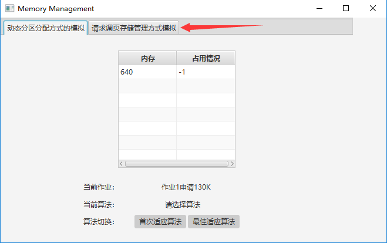

#### 1.1 整体界面

- 系统界面分为两部分，对应动态分区分配方式模拟和请求调页存储管理方式的模拟。两部分模拟分别在两个线程中执行，互不干扰，可通过界面上方的Tab切换。

#### 1.2 动态分区

- 第一部分用Table模拟内存，其中占用情况-1表示内存未被分配。
- 第二部分展示当前请求及选择的分配方式。
- 第三部分用来切换分配方式，有首次适应算法和最佳适应算法两种方式。

#### 1.3 调页存储

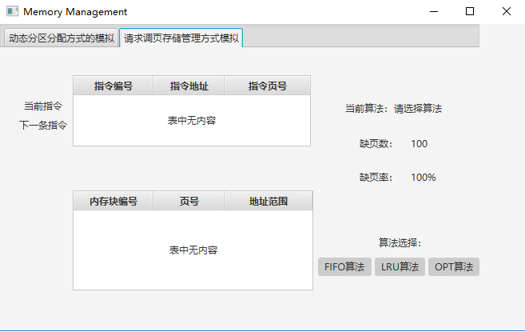

(为便于观察，地址采用十进制表示方式)

- 第一部分展示当前执行的指令以及下一条指令的编号，物理地址和所属页的页号。
- 第二部分用Table模拟内存，显示四个内存块存储的页面信息。
- 第三部分显示当前选择的置换算法，当前的缺页数和缺页率。
- 第四部分用来切换页面置换算法，有FIFO算法，LRU算法，OPT(最优置换)算法三种。


### 2.功能设计

#### 2.1 动态分区分配方式

​	内部维护一个与模拟内存的Table双向绑定的`ObservableList` 模拟分区链表。执行的请求序列存在同目录下的 ***application.txt*** 和 ***application_word.txt*** 中。

#####  2.1.1 分配流程：

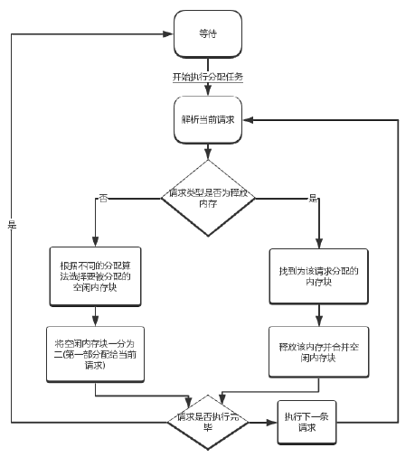

##### 2.1.2 相关算法

- 首次适应算法：

  ```java
  private int firstFit(Map map) {
      int size = (int)map.get("size");
      for(int i = 0;i<memoryPartitions.size();i++){
          MemoryPartition temp = memoryPartitions.get(i);
          if(temp.getSize()>=size && temp.getUser()==-1){
              return i;
          }
      }
      return -1;
  }
  ```
  
  遍历当前的内存块，找到第一个未被分配且大小大于或等于请求大小的内存块，并将该内存块的位置返回。
  
- 最佳适应算法：

  ```java
  private int bestFit(Map map){
      int size = (int)map.get("size");
      int bestIndex = -1;
      int bestSize = Integer.MAX_VALUE;
      for(int i = 0;i<memoryPartitions.size();i++){
          MemoryPartition temp = memoryPartitions.get(i);
          if(temp.getUser()==-1 && temp.getSize()>=size 
             && temp.getSize()<bestSize){
                  bestIndex = i;
                  bestSize = temp.getSize();
          }
      }
      return bestIndex;
  }
  ```
  
  
  
  遍历当前的内存块，找到一块未被分配且能满足请求大小的最小空闲内存块，返回该内存块的位置。
  
- 空闲内存块合并算法

  ```java
  private void merge(int position){
      MemoryPartition curMem = memoryPartitions.get(position);
      //与前面的块合并
      int pre = position - 1;
      if(pre >= 0){
          MemoryPartition preMem = memoryPartitions.get(pre);
          if(preMem.getUser() == -1){
              preMem.setSize(preMem.getSize() + curMem.getSize());
              memoryPartitions.remove(curMem);
              curMem = preMem;
              position -= pre;
          }
      }
      //与后面的块合并
      int post = position + 1;
      if(post < memoryPartitions.size()){
          MemoryPartition postMem = memoryPartitions.get(post);
          if(postMem.getUser()==-1){
              curMem.setSize(curMem.getSize() + postMem.getSize());
              memoryPartitions.remove(postMem);
         }
      }
  }
  ```

  ***position*** 为释放掉的内存块位置。分别判断该位置前后的内存块是否是未被分配的空闲块，如果是则与刚被释放的空闲块合并。

#### 2.2 请求调页存储管理

##### 2.2.1 流程图

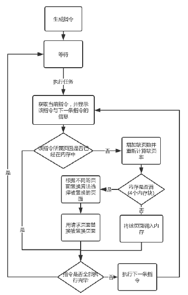

##### 2.2.2 相关算法

- 生成指令
  - 在0－319条指令之间，随机选取一个起始执行指令，如序号为m
  - 顺序执行下一条指令
  - 通过随机数，跳转到前地址部分0－m-1中的某个指令处，其序号为m<sub>1</sub>
  - 顺序执行下一条指令
  - 通过随机数，跳转到后地址部分m<sub>1</sub> + 2 - 319中的某条指令处，其序号为m<sub>2</sub>
  - 顺序执行下一条指令
  - 重复跳转到前地址部分、顺序执行、跳转到后地址部分、顺序执行的过程，直到执行完320条指令

- FIFO算法

  - 置换最早调入内存的页面

  - 因为模拟内存分区的链表 ***blockObservableList*** 是按照分配的先后顺序排列的，所以FIFO算法会选择链表中的第一个页面进行置换。置换实现如下：将第一个页面删除，将剩余页面上移，然后再将新调入的页面添加到链表末尾，以保持链表的有序。

- LRU算法

  - 按照最近最少使用原则进行换页

  - 用一个链表 ***LRURecords*** 来记录内存中页面的访问情况。当页面被加载到内存中时，将该页面添加到链表首部；当被置换时，将该页面从链表中删除；当被访问时，将链表中对应页面调整到链表首部。因此用LRU算法得到的将被置换的页面即链表 ***LRURecords*** 中的最后一个页面。

- OPT算法

  - 最优置换算法，置换掉最长时间不会使用的页

  - 用一个集合 ***records*** 来记录内存中的页面。遍历当前指令之后的指令集合，如果指令所属页面存在于集合 ***records*** 中，就将该页面从集合中删除。直到集合中只剩一个页面为止，该页面即符合要求的最长时间不会使用的页面。

  - 实现代码：

    ```java
    private int runOPT(){
        Map<Integer,Integer> pageToIndex = new HashMap<>();
        TreeSet<Integer> records = new TreeSet<>();
        for(int i = 0;i<blockObservableList.size();i++){
            pageToIndex.put(blockObservableList.get(i).getPage(),i);
            records.add(blockObservableList.get(i).getPage());
        }
        for(int i = curIndex + 1; i < instructions.size();i++){
            int page = instructions.get(i).getPage();
            records.remove(page);
            if(records.size() == 1){
                break;
             }
         }
        return pageToIndex.get(records.last());
    }
    
    ```

    

### 3.运行结果

#### 3.1 动态分区分配方式

- 首次适应算法

  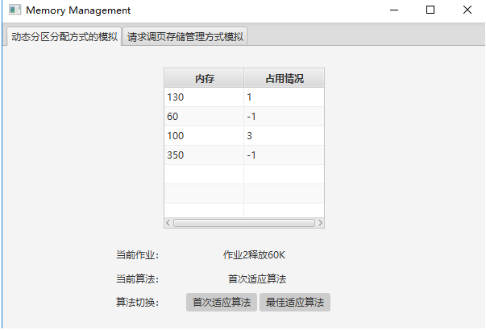

  结果：

  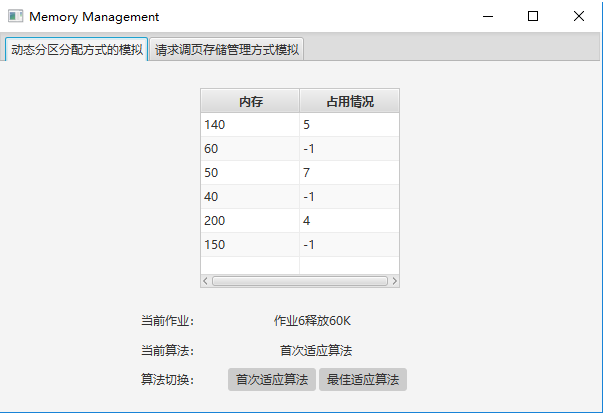

- 最佳适应算法

  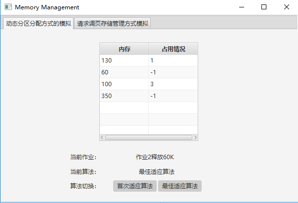

  结果：

  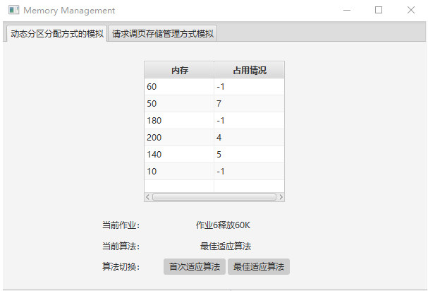

#### 3.2 请求调页存储管理方式模拟

- FIFO算法

  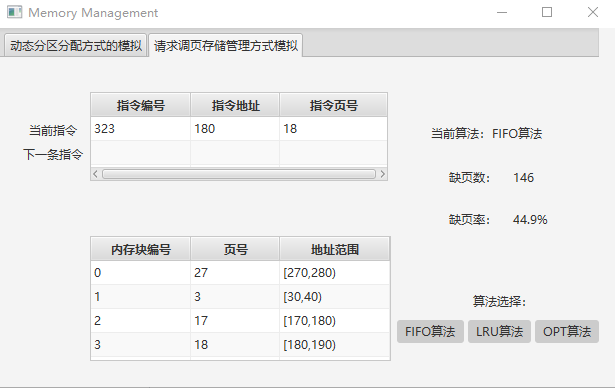

- LRU算法

  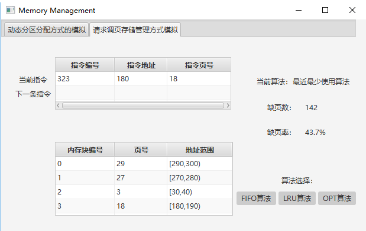

- OPT算法

  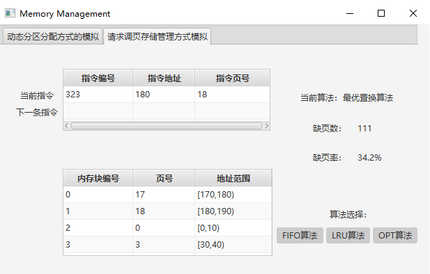

- 运行结果比较

  |   算法   | 缺页数 | 缺页率 |
  | :------: | :----: | :----: |
  | FIFO算法 |  148   | 44.9%  |
  | LRU算法  |  142   | 43.7%  |
  | OPT算法  |  111   | 34.2%  |

  

