## 文件系统 方案报告

>1651701
>
>
>
>魏楠

[TOC]

### 1.界面设计

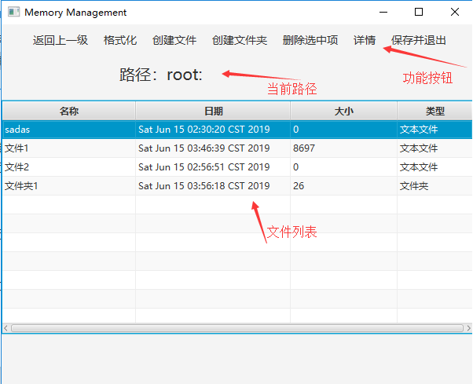

​	界面由**功能按钮**、**当前路径**、**文件列表**三部分组成。

- 功能按钮：包含**返回上一级**，**格式化**，**创建文件**，**创建文件夹**，**删除选中项**，**详情**，**保存并退出** 七个按钮组成。其中**删除选中项**，**详情**按钮只有选中文件/文件夹时才有效，**保存并退出**与窗口的关闭键功能相同。
- 路径：显示当前所在的路径，根路径为 **root:** 。
- 文件列表：显示当前路径中的所有文件，展示的信息包含**文件( 文件夹 )名称**，**最近修改日期**，**实际大小**，**文件类型**。

### 2.类设计

#### 2.1 Model类

- **Block** :记录文件系统中的物理块信息。包括该物理块的 ***id***，物理块中的二进制内容 ***binData***，该物理块所对应本地磁盘的文件路径 ***filePath***。
- **FCB** :文件控制块，用于记录文件(文件夹)的属性信息，占用一个***Block***。包括该文件( 文件夹 )的唯一标识 ***nodeId***, 名称 ***name***，类型 ***type*** （ 文本文件**FILE**或者文件夹**FOLDER **), 真实大小及实际占用空间大小，创建日期及最近修改日期，所属文件夹的**FCB**标识，文件数据所在块的索引***index***。如果FCB控制的是文本文件，***index*** 存储的是记录该文本信息的物理块的起始id；如果是文件夹，存储的是文件夹中首、尾文件的**FCB**标识。
- **FAT** ：文件分配表， 用一个***HashMap***记录文件系统中每个物理块的占用情况。

#### 2.2 Controller类

- **IO** ：记录文件系统的所有物理块。负责与本地磁盘交互，将文件系统中的文件信息保存到本地磁盘/读取本地磁盘中的文件复原文件系统。
- **DiskManager** ：负责与 **IO** 及 **SystemCore** 的通信。包含 **FAT** 表及 **IO** ，可以根据 **FAT** 表中的信息，分配空闲物理块、或调用 **IO** 读写文件数据。
- **SystemCore** ：系统核心类，包括当前文件夹的FCB ***currentDirFCB*** 及文件夹中的所有文件的FCB ***childrenFCB*** 。可以通过调用 **DiskManager** 来创建或删除文件/文件夹，读写文件，进入文件夹/返回上一级目录。
- **Controller** ：主控制类，接收用户的请求，如创建文件等，调用**SystemCore** 来完成其请求，并展示相应的**View**。

#### 2.3 Util类

- **GsonUtils**：本文件系统通过**Gson**将文件信息翻译为**JSON**格式保存在磁盘，该类可以将 **JSON** 文本解析为 **FCB** 对象或者 **FCB** 链表。

### 3.功能设计

#### 3.1 系统初始化与同步

- **IO** 读取物理块对应的文件

- 如果根目录文件不存在，则初始化文件系统

- 将磁盘中根目录所在物理块的信息取出、解析，展示到界面中

  展示：

  - 系统同步

    

    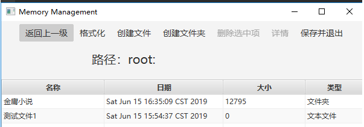

  - 系统初始化

    

    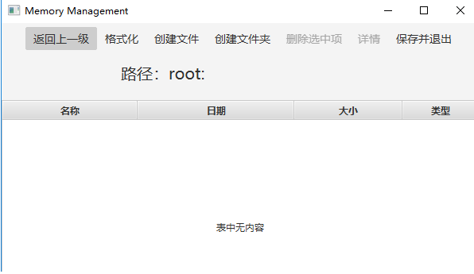

#### 3.2格式化

- 将当前目录置位根目录

- 清空物理块

- 初始化**FAT**表及根目录的**FCB**

  展示：

  - 格式化前

    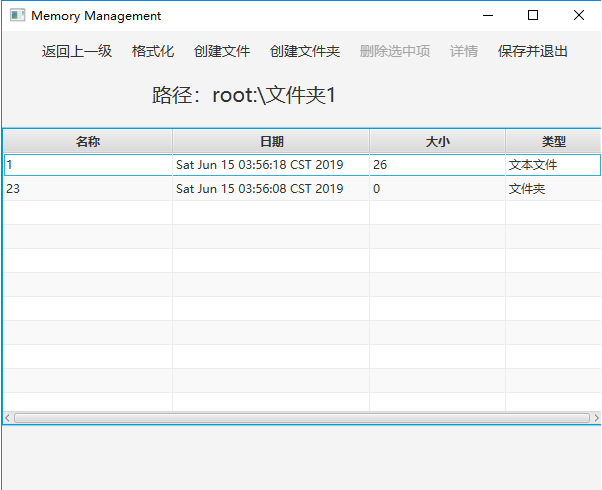

  - 格式化后

    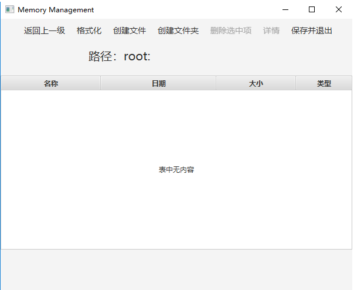

#### 3.3 创建文件

- 检查文件名称是否有冲突，如果冲突，则返回 ***Response(false,"该文件已存在")***

- 寻找一个空闲物理块，如果没有找到，则返回***Response(false,"磁盘空间不足")***

- 创建 **FCB**，修改 **FAT** 表，并逐级修改上一级目录的 **FCB** 信息(最近修改日期)。

  展示：

  - 输入文件名

    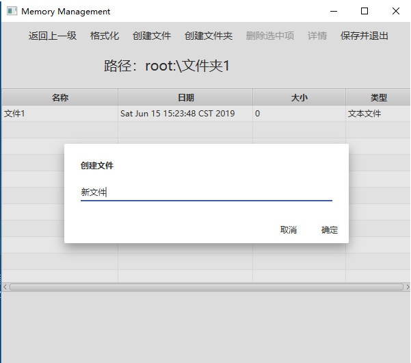

    - 如果有冲突

      

  - 创建成功

    

    - 逐级修改上级目录信息

      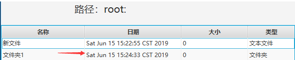

#### 3.4 创建文件夹

​	过程与创建文件相同，不再重复阐述与展示。

#### 3.5 删除文件

- 删除数据：根据该文件 **FCB** 记录的信息与 **FAT** 表结合，将该文件数据所在物理块置为空闲。

- 删除 **FCB**：将该FCB所在块置为空闲

- 逐级修改上级目录 **FCB** 信息：最近修改时间，真实大小，实际占用大小

  展示：

  - 选中要删除的文件

    

  - 删除成功

    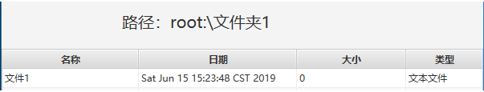

  - 逐级修改上级目录

    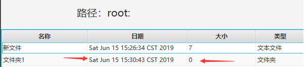

#### 3.6 删除文件夹

​	与删除文件类似，不再重复阐述与展示。要注意到不同之处在于删除文件夹还需要删除文件夹中的内容。如果存在子文件，则采用删除文件的方法删除；如果存在子文件夹，则递归删除该文件夹。

#### 3.7 进入下一级目录

- 双击文件夹进入下一级目录

- 将 ***currentDirFCB*** 置为进入文件夹的 **FCB**

- 根据 ***currentDirFCB***  中的 **index** ，与 **FAT** 表结合，读取子文件

- 更新当前路径及文件列表

  展示：

  - 选中要进入的文件夹

    

  - 进入成功

    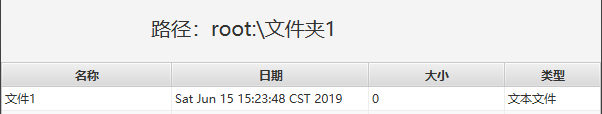

#### 3.8 返回上一级

- 根据 ***currentDirFCB*** 中的 ***parentFCBNodeId*** 寻找上一级文件及的FCB
- 如果未找到，则返回 ***Response(false,"已到达根目录")***
- 将 ***currentDirFCB*** 置为上一级文件夹的 **FCB**

- 根据上一级文件夹 **FCB** 中的 **index** ，与 **FAT** 表结合，读取子文件

- 更新当前路径及文件列表

  展示：

  - 当前目录

    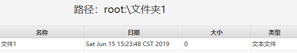

  - 返回上一级

    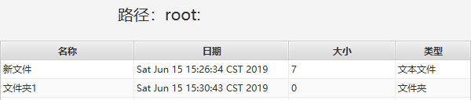

  - 已在根目录

    

#### 3.9 文件详情

- 根据选中文件的标识，找到其 **FCB**

- 用 **Dialog** 展示其 **FCB** 中记录的信息

  展示：

  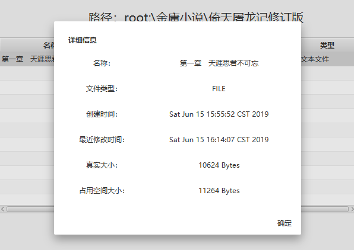

#### 3.10 读文件

- 双击文本文件

- 根据该文件 **FCB** 中 **index** 记录的信息，读取其数据，并展示

- 用户点击确定后，将现在的数据与之前读取的对比，如果有改变，则重新写文件

  展示：

  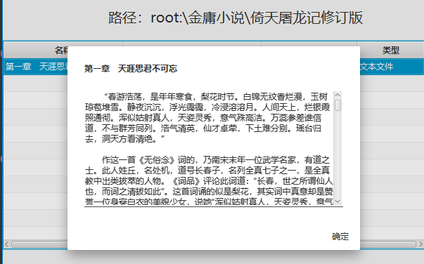

#### 3.11 写文件

- 获取要写入内容的大小，分配物理块

  - 如果当前文件数据的物理块装不下，则分配新的物理块
    - 如果分配新物理块时，找不到空闲物理块，则返回***Response(false,"磁盘空间不足")***
  - 如果当前文件数据的物理块过多，则将多分配的物理块置为空闲

- 将要写入的内容按照物理块大小分成不同的子结构写入物理块

- 修改当前文件的 **FCB** 并逐级修改上一级目录的 **FCB** ：最近修改时间，真实大小，占用空间大小

  展示：

  - 写入前：

    

    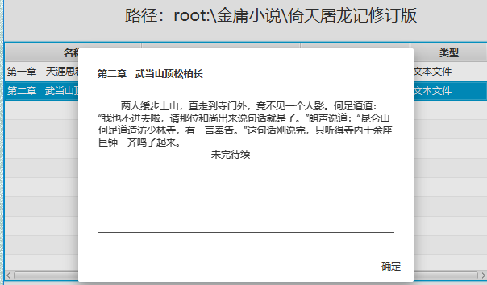

  - 写入后：

    

    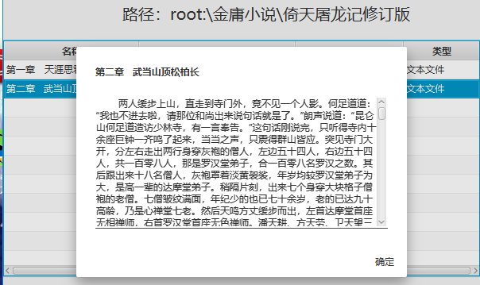
  
- 逐级更新上一级目录
  
    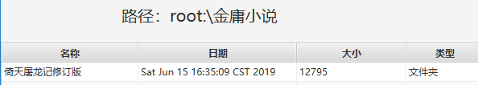

#### 3.12 保存并退出

- 点击窗口的退出按钮或者功能按钮中的保存并退出

- **IO** 将其中物理块的信息保存到对应本地磁盘的文件中

  展示：

  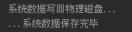

